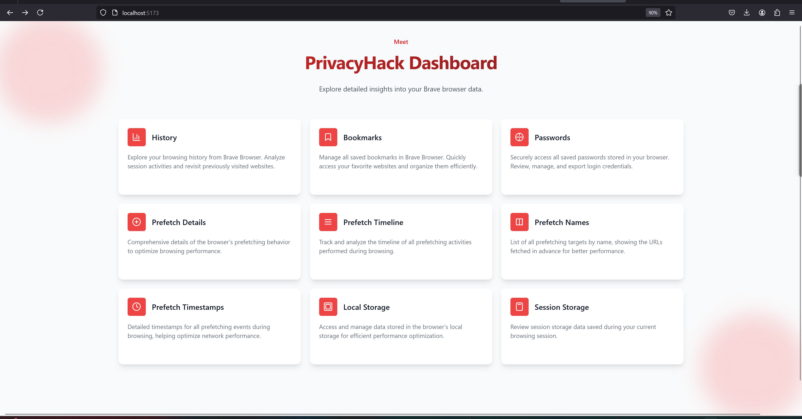
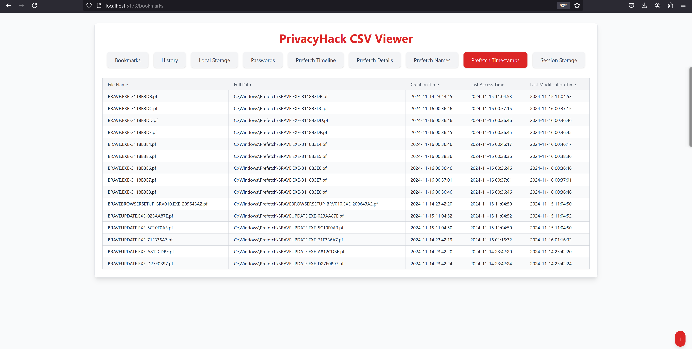

# PrivacyHack Dashboard & Browser Artifacts Forensics Tool

A comprehensive solution for digital forensics and browser artifact analysis, combining a modern web dashboard with powerful command-line tools for extracting, processing, and visualizing data from privacy-centric browsers like Brave.

---

## 🚀 Project Overview

**PrivacyHack Dashboard** is a React + Vite application designed for digital forensics, privacy enthusiasts, and anyone curious about their Brave browser data. It provides a seamless interface to:
- View and filter CSV data (history, bookmarks, passwords, etc.)
- Explore raw hex data for advanced analysis
- Switch between light and dark themes
- Enjoy a fast, responsive, and visually appealing UI

**Browser Artifacts Forensics Tool** (CLI/Backend) is a specialized toolkit for extracting, decrypting, and analyzing browser artifacts and Prefetch files, supporting integration into forensic workflows and outputting data in multiple formats.

---

## ✨ Features

### Web Dashboard
- **Dashboard Home**: Quick access to all data types with beautiful cards
- **Theme Toggle**: Instantly switch between light and dark modes
- **CSV Viewer**:
  - Tabbed navigation for different data types
  - Fast, filterable, scrollable tables with sticky headers
  - Black/green terminal-style table for easy reading
- **Hex Viewer**:
  - View raw hex data for all supported files
  - Tabbed navigation and easy scrolling
- **Modern UI**: Built with Tailwind CSS, React, and Vite for speed and style

### CLI/Forensics Tool
- Extracts and decrypts browser artifacts:
  - Bookmarks, Browsing history, Local storage, Session storage, Saved passwords
- Performs Prefetch file analysis for execution patterns
- Outputs data in CSV and JSON formats
- Integrates seamlessly into forensic workflows

---

## 📸 Screenshots

- 
- 

---

## 🛠️ Tech Stack

- **Frontend**: React, Vite
- **Styling**: Tailwind CSS
- **CSV Parsing**: PapaParse
- **Routing**: React Router
- **Backend/CLI**: Go, Python, PECmd

---

## 📂 Folder Structure

```
pro/
├── public/
│   ├── data/                # CSV and hex data files
│   └── ...
├── src/
│   ├── components/          # React components (Home, CSVViewer, Hex)
│   ├── assets/              # Static assets
│   ├── App.jsx              # Main app entry
│   └── ...
├── index.html
├── package.json
└── README.md
```

---

# 🧑‍💻 Forensics Tool Documentation

## Table of Contents
1. [Introduction](#introduction)
2. [Features](#features)
3. [System Requirements](#system-requirements)
4. [Installation](#installation)
    - [Go Application Setup](#go-application-setup)
    - [Python Setup](#python-setup)
    - [PECmd Setup](#pecmd-setup)
5. [Usage](#usage)
    - [Command-Line Interface](#command-line-interface)
    - [Prefetch Analysis](#prefetch-analysis)
6. [Artifact Categories](#artifact-categories)
7. [Workflow](#workflow)
8. [Troubleshooting](#troubleshooting)
9. [Best Practices](#best-practices)
10. [Conclusion](#conclusion)

## Introduction
The **Browser Artifacts Forensics Tool** is a specialized application designed for digital forensic investigators. It aids in extracting, processing, and analyzing browser artifacts from privacy-centric browsers like Brave. The tool also supports Prefetch file analysis to track program execution patterns, enabling investigators to construct detailed activity timelines.

## Features
- Extracts and decrypts browser artifacts:
  - Bookmarks
  - Browsing history
  - Local storage
  - Session storage
  - Saved passwords
- Performs Prefetch file analysis for execution patterns.
- Outputs data in multiple formats:
  - CSV
  - JSON
- Integrates seamlessly into forensic workflows.

## System Requirements
- **Operating System**: Windows
- **Dependencies**:
  - **Go**: To run the core application.
  - **Python 3.8+**: For additional analysis modules.
  - **PECmd**: For Prefetch file analysis.

## Installation

### Go Application Setup
1. **Download and Install Go**:
   - Visit [Go's official website](https://golang.org) and download the latest version.
2. **Verify Installation**:
   - Run: `go version`
3. **Build the Application**:
   - Navigate to the directory containing `main.go`.
   - Run: `go build -o forensic_tool main.go`

### Python Setup
1. **Download and Install Python**:
   - Visit [Python's official website](https://python.org) and download the latest version.
   - Ensure "Add Python to PATH" is selected during installation.
2. **Verify Installation**:
   - Run: `python --version`
3. **Install Dependencies**:
   - Navigate to the directory with `requirements.txt`.
   - Run: `pip install -r requirements.txt`

### PECmd Setup
1. **Download PECmd**:
   - Download the tool from [here](https://download.mikestammer.com/net6/PECmd.zip).
2. **Setup PECmd**:
   - Copy `PECmd.exe` and `PECmd.dll` to the tool's working directory.
   - Add the directory to your system's PATH.
3. **Verify Installation**:
   - Run: `PECmd.exe -h`

## Usage

### Command-Line Interface
- **Go Application**:
  ```bash
  ./forensic_tool --input=<path_to_browser_artifacts> --output=<output_directory>
  ```
- **Python Module**:
  ```bash
  python main.py --artifact=<artifact_type> --input=<path_to_data>
  ```

### Prefetch Analysis
Analyze Prefetch files using PECmd:
```bash
PECmd.exe -f <path_to_prefetch_file> -o <output_directory>
```

## Artifact Categories
- **Bookmarks**:
  - Extracts URLs and metadata.
- **Browsing History**:
  - Retrieves user activity logs.
- **Local Storage**:
  - Accesses key-value pairs stored locally.
- **Saved Passwords**:
  - Decrypts and analyzes encrypted credentials.
- **Prefetch Analysis**:
  - Investigates program execution patterns.
- **Session Storage**:
  - Analyzes key-value pairs from active browsing sessions.

## Workflow
1. **Initialization**:
   - Parses inputs and sets up dependencies.
2. **Artifact Location**:
   - Identifies browser profiles (e.g., `C:\Users\<User>\AppData\Local\BraveSoftware\Brave-Browser\User Data\Default`).
3. **Data Extraction**:
   - Uses SQL queries and JSON parsing.
4. **Decryption**:
   - Decrypts sensitive data using the browser's encryption keys.
5. **Output Generation**:
   - Saves data in CSV and JSON formats.
6. **Prefetch Analysis**:
   - Extracts execution times, accessed files, and metadata.

## Troubleshooting
### PECmd Issues
- Ensure compatibility with Prefetch files.
- Verify files are not corrupted or locked.

### Python Dependency Issues
- Update libraries using `pip install -r requirements.txt`.
- Ensure Python 3.8 or higher is installed.

### Go Application Issues
- Verify Go installation with `go version`.
- Resolve dependency issues with `go mod tidy`.

### Output Errors
- Verify input paths and ensure data files are not corrupted.

## Best Practices
- Use the tool in an isolated forensic environment.
- Secure sensitive data during analysis.
- Keep dependencies and tools updated for optimal performance.

## Conclusion
The **Browser Artifacts Forensics Tool** offers an efficient and robust solution for analyzing artifacts from privacy-centric browsers. Its comprehensive feature set, including Prefetch analysis and data extraction, empowers forensic investigators to uncover critical evidence while maintaining data integrity.

---

# 🌐 Web Dashboard Usage

## ⚡ Getting Started

### 1. Clone the repository
```sh
git clone https://github.com/<your-username>/<repo-name>.git
cd <repo-name>
```

### 2. Install dependencies
```sh
npm install
```

### 3. Run the development server
```sh
npm run dev
```

### 4. Open in your browser
Visit [http://localhost:5173](http://localhost:5173) (or the port shown in your terminal).

---

## 📝 Usage
- Use the **theme toggle** (top right) to switch between light and dark modes.
- Click **CSV Viewer** or **Hex Viewer** on the home page for detailed data exploration.
- Use the search bar in CSV Viewer to quickly filter table rows.
- Scroll horizontally and vertically for large tables; headers stay visible.

---

## 📑 Data Files
- Place your Brave browser CSV and hex files in the `public/data/` and `public/data/hex/` folders, respectively.
- Supported files: history, bookmarks, passwords, local/session storage, prefetch details, etc.

---

## 🤝 Credits
- Built with [React](https://reactjs.org/), [Vite](https://vitejs.dev/), and [Tailwind CSS](https://tailwindcss.com/)
- CSV parsing by [PapaParse](https://www.papaparse.com/)
- UI inspired by modern dashboard and terminal designs

---

## 📬 Contributing
Pull requests and suggestions are welcome! For major changes, please open an issue first to discuss what you would like to change.

---

## 📄 License
[MIT](LICENSE)
